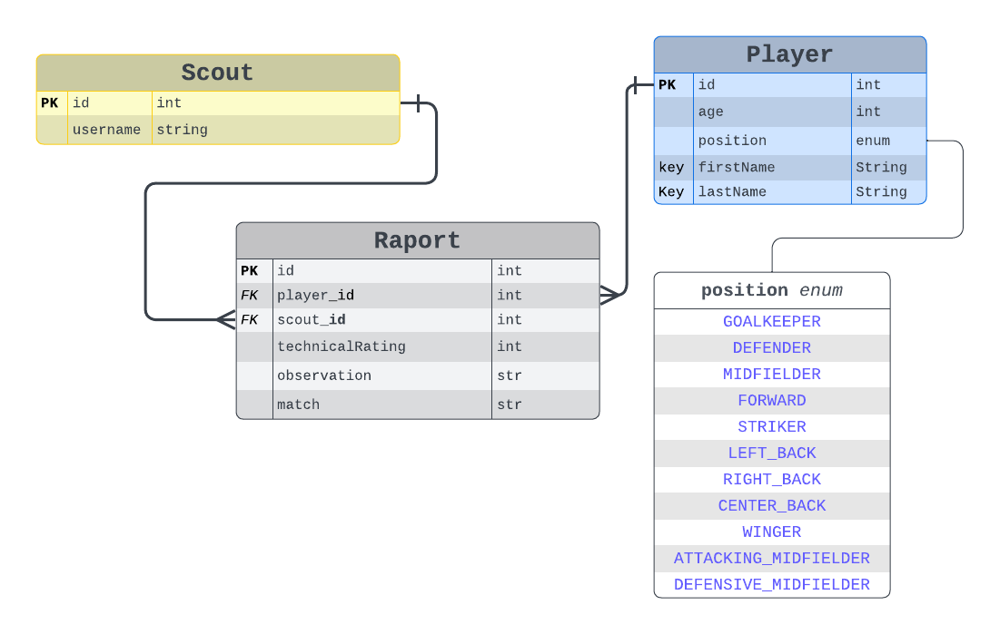

## 🗂️ Database Design



### Run PostgreSQL with Docker

To run PostgreSQL using Docker, use the following command:

```bash
docker run --name postgres-container -e POSTGRES_PASSWORD=tmpPass -e POSTGRES_USER=postgres -e POSTGRES_DB=scoutingdb -p 5432:5432 -d postgres:13
```

This will start a PostgreSQL container on port `5432` with the database `scoutingdb`.

---

### For running the Project

1. Clone the repository:
   ```bash
   git clone https://github.com/imadovetch/Exercice-DDD/ Demo-test
   cd Demo-test
   ```

2. Run the Spring Boot application:
   ```bash
   ./mvnw spring-boot:run
   ```

PS : make sure PostgreSQL is running before you start the app.
### Project Status 
The project is still in development. It is not broken, but no core functionality is implemented at the moment. 
